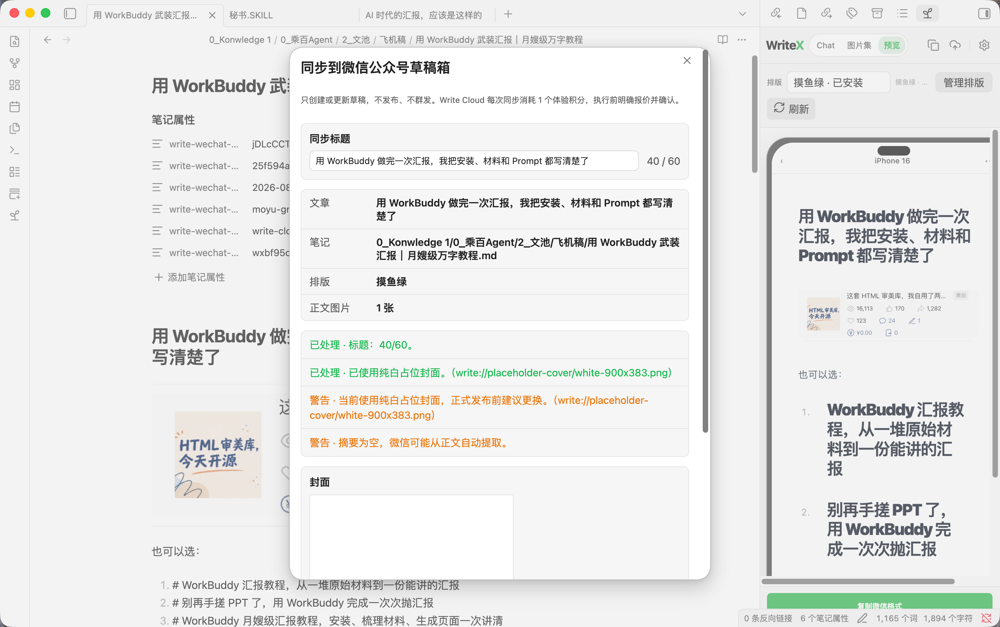

# WriteX

## 让 AI 强化原创

不是让 AI 替你生成一篇看起来很完整、读完却不像你的文章。

你提供经历、材料、判断和最后一笔。WriteX 把 Agent 写作、图片、公众号排版和草稿同步放进当前 Obsidian 笔记旁边，让 AI 帮你梳理、改写和补强，但不把作者的位置让出去。

腾讯朱雀会把“大概率由 AI 生成或经 AI 大幅改写”的文本列为高风险，把“存在一定 AI 生成或辅助改写特征”的文本交给人工复审；它也明确提醒检测结果只能辅助判断，不能作为唯一依据。WriteX 不承诺绕过任何检测器，它解决的是更根本的问题：让文章从你的真实材料出发，让 AI 强化原创，而不是替代原创。

[腾讯朱雀 AI 文本检测](https://matrix.tencent.com/ai-detect/ai_gen_txt/) · [腾讯云 AI 生成识别等级说明](https://cloud.tencent.com/document/product/1124/59257)

> 只创建或更新草稿。不会自动发布，不会群发。

<!-- 发布前替换为 30 秒 GIF；当前先使用真实界面静态图占位。 -->



## 30 秒开始

WriteX 需要 Obsidian 1.11.4 或更高版本。安装后：

1. 打开一篇 Obsidian 笔记。
2. 从右侧栏打开 WriteX。
3. 选中一段文字，交给 Codex、Claude 或 WorkBuddy。
4. 把回复替换回原文，切到“预览”检查手机排版。
5. 需要时再同步到微信公众号草稿箱。

不想用 AI 也没关系。预览、排版、图片管理和草稿同步仍然可以独立使用。

## 它适合什么场景

### 一堆材料，还不是一篇文章

采访、旧稿、灵感都在 Vault 里。选中真正相关的内容，让 Agent 帮你梳理角度、大纲或某一段，而不是把整个资料库上传到一个新平台。

### 文章写完了，但公众号排版还没开始

正文继续在 Markdown 里改。WriteX 用固定手机视图检查标题、层级、图片和留白，选好排版后再复制或同步。

### 同一篇草稿要继续修改

正文变化、标题不变时，WriteX 更新原草稿；标题变化时创建新草稿，旧草稿不会被悄悄覆盖。

### 想试完整流程，但没有固定 IP 服务器

可以主动选择 Write Cloud 免费体验。第一个符合条件的真实公众号赠送 8 个体验积分，每次成功同步消耗 1 分。同步前先报价，最后确认后才上传文章和图片。

## 核心功能

### 在当前笔记里用 Agent

- 支持 Codex、Claude 和 WorkBuddy 三条独立通道。
- 支持选区上下文、Chat / Plan 模式、停止生成和会话续接。
- 回复可以复制、插入光标、追加文末或替换原选区。
- 原文已变化时拒绝误覆盖。
- 可以明确选择一个本地 Skill；不会暗中叠加多个 Skill。
- 一个 Agent 失败时，不会偷偷换另一个 Agent 冒充成功。

### 图片和公众号排版

- Agent 生图、自带图片 API 和手动导入分开标记来源。
- 图片保存为真实 Vault 文件，可以拖入正文、复制、插入或重新生成。
- 预览、复制和草稿同步共用同一套排版结果。
- 固定手机视图跟随正文刷新，方便在最后一步前检查成稿。

### 安全同步到草稿箱

- 同步前先看目标公众号、创建或更新、封面、正文图片、排版和费用。
- 最后确认始终放在执行步骤顶部。
- 相同内容直接显示“已是最新”，不会请求服务器。
- 明确失败或取消不会扣 Write Cloud 积分。
- 微信结果未知时停止盲目重试，避免重复草稿。
- 留言默认开启，仍可在确认前关闭。

## 使用 WorkBuddy，为什么还要装 CodeBuddy？

因为 WriteX 不能、也不应该去读取 WorkBuddy 桌面 App 的私有登录信息。

腾讯官方提供的 `codebuddy` / `cbc` CLI 是给脚本和第三方工具使用的连接层。它负责官方登录、返回结构化结果，以及用同一个 Session 继续对话。WriteX 只通过这条公开接口连接 WorkBuddy。

对用户来说，它应该只是一次性安装的“WorkBuddy 连接组件”，不是另一个要学习的产品。

### 最短连接步骤

需要 Node.js 18 或更高版本。

1. 复制这一条确定的安装命令到终端：

   ```bash
   npm install -g @tencent-ai/codebuddy-code
   ```

2. 运行一次 `codebuddy`，在浏览器完成官方登录。
3. 回到 `Obsidian → 设置 → WriteX → AI设置`，点击重新检测。

不建议复制一段提示词，让 WorkBuddy 自己安装。安装全局程序和账号授权是高权限动作，应该由用户看见、确认，并由确定的命令完成。

官方资料：[CodeBuddy CLI](https://www.workbuddy.ai/docs/cli/) · [Headless 模式](https://www.workbuddy.ai/docs/cli/headless)

## 两条公众号同步路线

| 路线 | 适合谁 | WriteX 积分 |
| --- | --- | ---: |
| 用户自建 Relay | 已有固定 IP，希望自己保管公众号凭据 | 0 |
| Write Cloud 免费体验 | 不想先部署服务器，想直接验证完整流程 | 首次符合条件的公众号赠送 8 分；成功同步 1 分 |

两条路线彼此独立，不会自动切换。

## 数据安全

- **正文归 Obsidian**：文章始终是 Vault 里的 Markdown 笔记，WriteX 不另存一份云端正文作为编辑源。
- **凭据不进普通配置**：Relay Key、图片 API Key 和 Write Cloud 匿名设备凭据放在 Obsidian SecretStorage，不写进 `data.json`。
- **AppSecret 分路线保存**：自建路线由你自己的 Relay 保存；Write Cloud 只在你点击确认后接收，并在服务端加密保存。
- **写入前必确认**：真实公众号操作会显示目标、内容范围、创建或更新、费用与余额变化。
- **不静默回退**：没有可用 Agent、云服务或图片能力时直接报错，不暗中切到另一个付费 Provider。
- **自建路线永久免费**：用户自建 Relay 永远消耗 0 WriteX 积分。

## 隐私与边界

这些信息应该在安装前说清楚：

- 发送消息时，所选 Agent 会收到当前笔记内容。
- WorkBuddy 通道允许读取 Vault 工作目录中获准读取的上下文。它是只读通道，但不是严格的单文件沙箱。
- WriteX 保存继续对话所需的 Session ID；Agent CLI 也可能在本机保存自己的会话记录。
- Agent CLI、主题下载、用户选择的图片 API、自建 Relay 和 Write Cloud 会分别联网。
- WriteX 当前没有客户端行为遥测。点赞或点踩只在本地保存匿名结构偏好，不上传历史正文。
- WriteX 插件源码采用 AGPL-3.0-only 开源；可选的托管 Write Cloud 是独立的闭源服务。
- 当前没有支付、订阅、充值或积分购买功能。
- 当前只支持 Obsidian 桌面端和单个已验证公众号的 Write Cloud 体验流程。
- 没有正式发布、群发、定时发布、自动同步、数据分析、团队或多渠道分发。

## 安装

正式进入 Obsidian 社区插件目录前，可以从 GitHub Release 手动安装测试版：

1. 下载同一版本的 `main.js`、`manifest.json` 和 `styles.css`。
2. 放入：

   ```text
   <你的 Vault>/.obsidian/plugins/writex/
   ```

3. 在 `Obsidian → 设置 → 第三方插件` 中启用 WriteX。
4. 替换版本后，请真正关闭再开启插件；只刷新插件列表可能仍在运行旧代码。

## 开发

```bash
npm install
npm run check
```

生产构建生成 `main.js`、`manifest.json` 和 `styles.css`。

## 当前版本

`v0.5.3` 是插件 ID 迁移候选。新 ID 为 `writex`；首次启用前必须先停用旧 `obsidian-agent`。如果新目录还没有自己的 `data.json`，WriteX 会复制旧数据并保留旧文件不动；既有 SecretStorage 键与侧栏视图类型保持兼容。可下载安装的 GitHub Release 仍是单独发布步骤，源码公开不等于已经进入 Obsidian 社区目录。

可安装主题包及其来源、作者和许可证：<https://github.com/pakco77/writex-theme-packs>。
