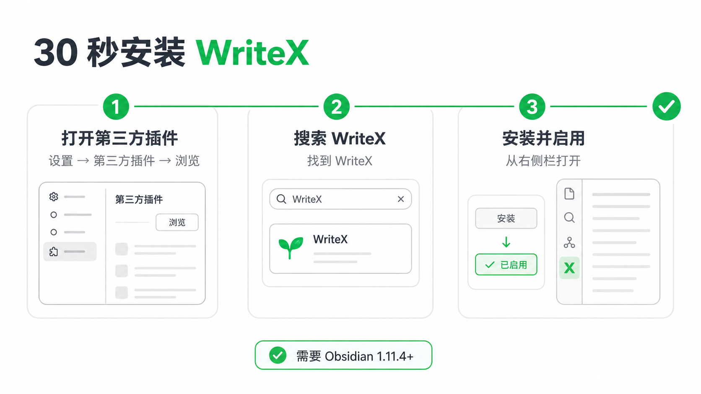
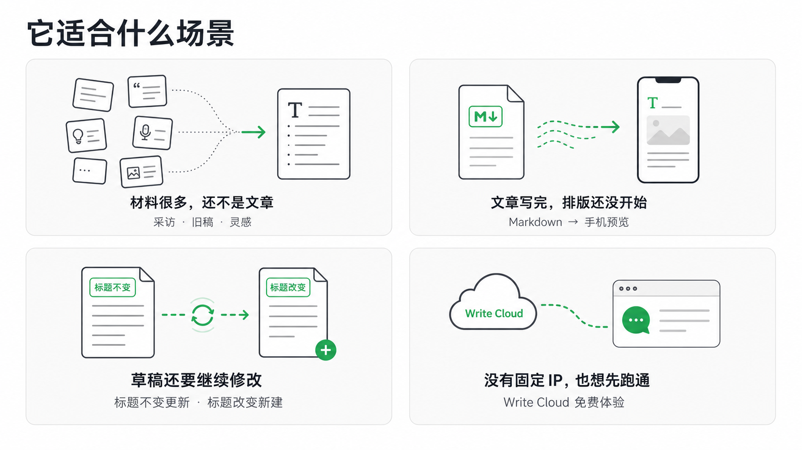

# WriteX

## 让 AI 强化原创

你提供经历、材料和判断，AI 帮你梳理、改写和补强。WriteX 把 Agent、图片、公众号排版和草稿同步放进当前 Obsidian 笔记旁边，但不把作者的位置让出去。

它不承诺绕过 AI 检测。它做的是让文章从你的真实材料出发，而不是生成一篇完整却不像你的文章。

> 只创建或更新微信公众号草稿。不会自动发布，不会群发。

<!-- 发布前替换为 30 秒 GIF；当前先使用真实界面静态图占位。 -->


## 30 秒安装 WriteX



<details>
<summary>查看文字安装路径</summary>

1. 打开 `Obsidian → 设置 → 第三方插件 → 浏览`。
2. 搜索 `WriteX`，点击“安装”，然后“启用”。
3. 打开一篇笔记，从右侧栏进入 WriteX。

</details>

WriteX 需要 Obsidian 1.11.4 或更高版本。

当前 `v0.5.3` 仍是源码候选，尚未发布可下载安装包。首个 GitHub Release 发布后，测试用户也可以把同一版本的 `main.js`、`manifest.json` 和 `styles.css` 放进：

```text
<你的 Vault>/.obsidian/plugins/writex/
```

然后在第三方插件中启用 WriteX。源码公开不等于已经上架。

## 它适合什么场景



<details>
<summary>查看文字版场景</summary>

- **材料很多，还不是一篇文章**：从采访、旧稿和灵感中找角度、搭结构或改一段。
- **文章写完了，排版还没开始**：Markdown 正文、手机预览、图片和公众号排版保持同步。
- **同一篇草稿还要继续修改**：标题不变更新原稿；标题改变创建新稿。
- **没有固定 IP，也想先跑通**：主动选择 Write Cloud 免费体验。

</details>

## 核心功能

- **Agent 写作**：在当前笔记里使用 Codex、Claude 或 WorkBuddy，回复可以安全替换、插入或追加。
- **图片与排版**：管理正文图片和排版主题，用固定手机视图检查最终效果。
- **草稿同步**：执行前显示目标、创建或更新、内容范围和费用；最后确认后才写入公众号草稿箱。
- **本地优先**：Markdown 正文留在 Vault；Agent、同步路线和图片能力都由用户明确选择，不静默回退。

## 两条公众号同步路线

| 路线 | 适合谁 | WriteX 积分 |
| --- | --- | ---: |
| 用户自建 Relay | 已有固定 IP，希望自己保管公众号凭据 | 0 |
| Write Cloud 免费体验 | 不想先部署服务器，想直接验证完整流程 | 首次符合条件的公众号赠送 8 分；成功同步 1 分 |

两条路线彼此独立，不会自动切换。

## 数据安全

- **正文归 Obsidian**：Markdown 笔记始终是唯一编辑源。
- **凭据不进普通配置**：Relay Key、图片 API Key 和 Write Cloud 匿名设备凭据保存在 Obsidian SecretStorage，不写进 `data.json`。
- **真实写入前必确认**：同步前明确显示目标、内容、创建或更新、费用和余额变化。
- **自建路线不收费**：用户自建 Relay 永远消耗 0 WriteX 积分。
- **没有客户端遥测**：本地点赞或点踩只保存结构偏好，不上传历史正文。

## 隐私与边界

- 发送消息时，所选 Agent 会收到当前笔记内容；WorkBuddy 可读取 Vault 中获准读取的上下文，不是严格的单文件沙箱。
- Agent CLI、主题下载、用户选择的图片 API、自建 Relay 和 Write Cloud 会分别联网，并遵循各自的服务条款。
- Write Cloud 是可选的闭源托管服务；开源插件、本地 Agent、预览复制和自建 Relay 不依赖它。
- 当前没有支付、订阅、充值、正式发布、群发、定时发布、自动同步、数据分析、团队或多渠道分发。
- Write Cloud 仍处于受控体验阶段，尚未提供自助删除连接/AppSecret 和撤销安装/会话的完整能力。

更完整的边界见 [隐私说明](docs/PRIVACY.md)和[公开仓库边界](docs/PUBLIC_BOUNDARY.md)。

## 从旧版迁移

`v0.5.3` 把插件 ID 从 `obsidian-agent` 改为 `writex`。升级时先停用旧插件；如果新目录没有自己的数据，WriteX 会复制旧数据并保留原文件不动。既有 SecretStorage 键与侧栏布局保持兼容。

旧插件的自定义快捷键不会自动迁移，需要在 Obsidian 快捷键设置中重新绑定。

## 开发

```bash
npm install
npm run check
```

插件源码采用 AGPL-3.0-only。可安装主题包及其来源、作者和许可证见 <https://github.com/pakco77/writex-theme-packs>。

[参与贡献](.github/CONTRIBUTING.md) · [安全报告](.github/SECURITY.md) · [发布清单](docs/RELEASING.md) · [商标说明](docs/TRADEMARKS.md)
