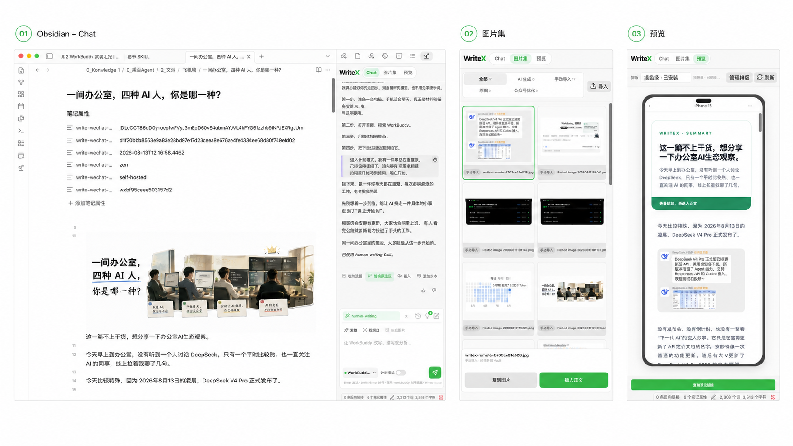

# WriteX

[](https://github.com/pakco77/WriteX/releases)
[](LICENSE)
[](https://obsidian.md)

## English

WriteX is an Obsidian-native writing workspace for WeChat creators. Your Markdown note remains the source of truth while you use Codex, Claude, or WorkBuddy to develop material, generate images, preview WeChat layouts, and create or update WeChat drafts only. It never publishes or mass-sends on your behalf. Its optional style profile is created only from representative work you explicitly select; it does not scan or learn from your Vault automatically.

Highlights: one-click Skill installs from a GitHub URL (enabled right away), seven deterministic WeChat layout themes with official color palettes, callout syntax (`> [!note|tip|warning|quote]`), a left-syntax/right-demo usage guide for every theme, chat attachments with image context, and two explicit WeChat draft sync routes (self-hosted Relay at 0 credits, or the optional Write Cloud trial).

## 中文

## AI 强化原创

不再为写公众号单独购买一套 AI 服务。

WriteX 直接调用你本地的 Agent，共用现有的 AI 订阅额度，不额外产生模型调用成本。它把散落在聊天记录、文件夹和不同工具里的创作流程，收拢到一个固定的 Obsidian 工作台中。现支持 Codex、Claude、WorkBuddy。

从记录想法、筛选选题、寻找切口、整理大纲，到 AI 生图、公众号排版，手机端预览、再一键同步至草稿箱，都在当前笔记旁边完成。

你提供真实经历、材料和判断，Agent 负责梳理、改写与补强。WriteX 不替你成为作者，只帮你把原本想说的话，表达得更完整。

它不承诺绕过 AI 检测，也不会自动发布或群发文章。它只创建或更新微信公众号草稿，最终发不发，仍由你决定。

> 只创建或更新微信公众号草稿。不会自动发布，不会群发。



## 30 秒安装 WriteX


<details>
<summary>查看文字安装路径</summary>

1. 从 [WriteX v0.6.1](https://github.com/pakco77/WriteX/releases/tag/0.6.1) 下载 `main.js`、`manifest.json` 和 `styles.css`。
2. 将三份文件放进 `<你的 Vault>/.obsidian/plugins/writex/`；从旧版 `obsidian-agent` 迁移时，保留旧目录和数据，并只启用 `writex`。
3. 重启 Obsidian，在 `设置 → 第三方插件` 启用 WriteX，然后打开一篇笔记，从右侧栏进入。

</details>

WriteX 需要 Obsidian 1.11.4 或更高版本。

当前可用的手动安装包是 [v0.6.1 GitHub Release](https://github.com/pakco77/WriteX/releases/tag/0.6.1)，仅含上面三份文件：

```text
<你的 Vault>/.obsidian/plugins/writex/
```

然后在第三方插件中启用 WriteX。GitHub Release 是当前可用的手动安装来源；Obsidian Community 条目可能仍显示较早的审核版本，请以客户端实际显示版本为准。

## 它适合什么场景


<details>
<summary>查看文字版场景</summary>

- **材料很多，还不是一篇文章**：从采访、旧稿和灵感中找角度、搭结构或改一段。
- **文章写完了，排版还没开始**：Markdown 正文、手机预览、图片和公众号排版保持同步。
- **同一篇草稿还要继续修改**：标题不变更新原稿；标题改变创建新稿。
- **没有固定 IP，也想先跑通**：主动选择 Write Cloud 免费体验。

</details>

## 核心功能

- **我的文风**：只从你显式选择的代表作提炼一份 Vault 本地档案；按笔记开关，可与当前任务 Skill 同时使用，不会自动扫描或持续学习。
- **独立选题页**：选题以主编辑区页签、按记录时间分组的卡片呈现；选择目标笔记后只预填 Chat，不会自动发送、建稿或改变写作设置。
- **对比替换**：划词改写先展示原文与建议的本地差异；只有明确“应用建议”且原选区未变，才执行一次编辑器替换。
- **Chat 附件与图片上下文**：用回形针选择文件、拖入 Chat 或从剪贴板粘贴；发送前可移除，附件只在当前 Vault 的该条消息中保留。
- **Skill 创作与一键安装**：在 Chat 中选择 Vault Skill 用于文字创作与图片生成；也可以直接在 Chat 中生成图片；粘贴 GitHub 仓库地址即可安装 Skill，装完直接启用，不用手动翻目录。
- **三种 Agent**：支持 Codex、Claude 和 WorkBuddy。调用使用你自己的 Agent 订阅或 API 额度，不消耗 WriteX 积分。
- **历史与选题**：保留各 Agent 的会话历史，把值得继续写的回复一键收为选题。
- **图片集与预览**：管理正文图片和排版主题，用固定手机视图检查最终效果。
- **公众号排版主题**：7 套确定性主题（红白、橄榄手记、摸鱼票据、石墨极简、留白禅意、摸鱼绿、赛博朋克），每套 2–3 个官方色板，一键换色不重排；排版库内置"使用说明"，左边符号、右边按当前主题真实渲染的 demo。
- **Callout 扩展语法**：在正文写 `> [!note]`、`> [!tip]`、`> [!warning]`、`> [!quote]` 即可生成提示、技巧、警示与金句卡；警示框全主题统一琥珀色，金句卡自动居中。
- **公众号交付**：可一键复制微信公众号格式；也可使用高级同步，一键创建或更新草稿，执行前仍需确认。
- **本地优先**：Markdown 正文留在 Vault；Agent、同步路线和图片能力都由用户明确选择，不静默回退。

## 两条公众号同步路线

| 路线 | 适合谁 | WriteX 积分 |
| --- | --- | ---: |
| 用户自建 Relay | 已有固定 IP，希望自己保管公众号凭据 | 0 |
| Write Cloud 免费体验 | 不想先部署服务器，想直接验证完整流程 | 首次符合条件的公众号赠送 8 分；成功同步 1 分 |

两条路线彼此独立，不会自动切换。

## 数据安全

- **正文归 Obsidian**：Markdown 笔记始终是唯一编辑源。
- **文风需明确确认**：代表作只在你发起提炼时交给当前选择的 Agent；确认前不会保存候选，导出本地 Skill 也需要单独确认。
- **附件留在本地**：Chat 附件写入当前 Vault 的消息附件目录，不自动进入文章正文、图片集或远程 Relay/Cloud。
- **凭据不进普通配置**：Relay Key、图片 API Key 和 Write Cloud 匿名设备凭据保存在 Obsidian SecretStorage，不写进 `data.json`。
- **真实写入前必确认**：同步前明确显示目标、内容、创建或更新、费用和余额变化。
- **自建路线不收费**：用户自建 Relay 永远消耗 0 WriteX 积分。
- **没有客户端遥测**：本地点赞或点踩只保存结构偏好，不上传历史正文。

## 隐私与边界

- 发送消息时，所选 Agent 会收到当前笔记内容以及本条消息明确附上的附件；仅在你发起文风提炼时，当前 Agent 才会收到你显式选择的代表作。WorkBuddy 可读取 Vault 中获准读取的上下文，不是严格的单文件沙箱。
- Agent CLI、主题下载、用户选择的图片 API、自建 Relay 和 Write Cloud 会分别联网，并遵循各自的服务条款。
- Write Cloud 是可选的闭源托管服务；开源插件、本地 Agent、预览复制和自建 Relay 不依赖它。
- 当前没有支付、订阅、充值、正式发布、群发、定时发布、自动同步、数据分析、团队或多渠道分发。
- Write Cloud 仍处于受控体验阶段。它提供当前设备撤销以及连接/AppSecret 删除；完整的设备/会话清单与管理能力尚未提供，且每一项破坏性操作都需要单独确认。

更完整的边界见 [隐私说明](docs/PRIVACY.md)和[公开仓库边界](docs/PUBLIC_BOUNDARY.md)。

## 从旧版迁移

`v0.5.3` 把插件 ID 从 `obsidian-agent` 改为 `writex`。升级时先停用旧插件；如果新目录没有自己的数据，WriteX 会复制旧数据并保留原文件不动。既有 SecretStorage 键与侧栏布局保持兼容。

旧插件的自定义快捷键不会自动迁移，需要在 Obsidian 快捷键设置中重新绑定。

## 开发

```bash
npm install
npm run check
```

插件源码采用 AGPL-3.0-only。可安装主题包及其来源、作者和许可证见 <https://github.com/pakco77/writex-theme-packs>。

[参与贡献](.github/CONTRIBUTING.md) · [安全报告](.github/SECURITY.md) · [发布清单](docs/RELEASING.md) · [商标说明](docs/TRADEMARKS.md)
